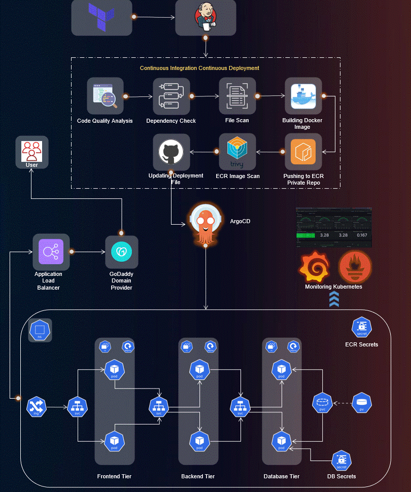
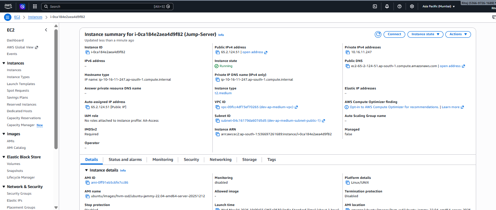
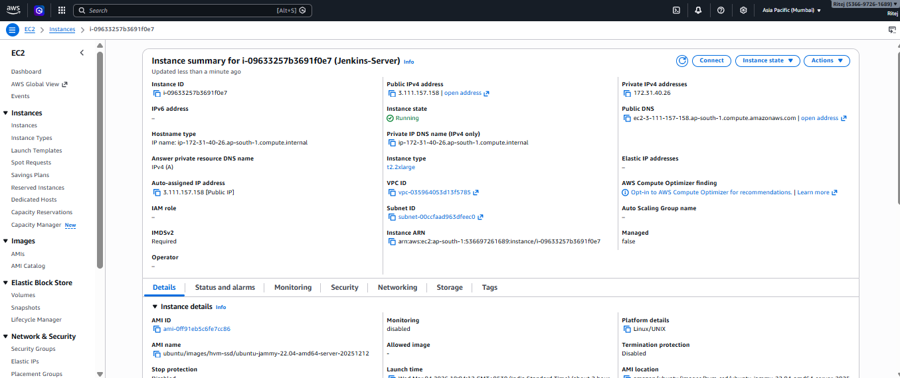
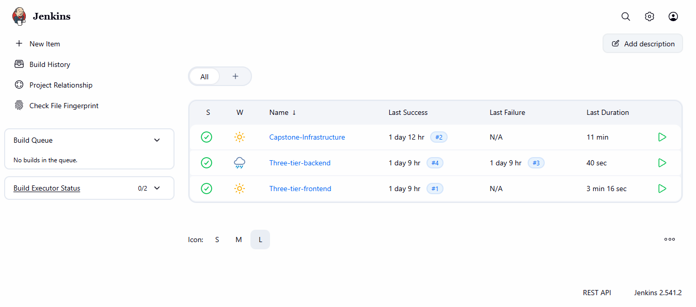
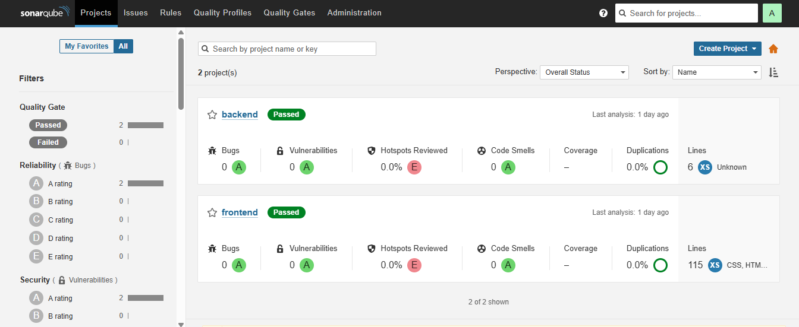
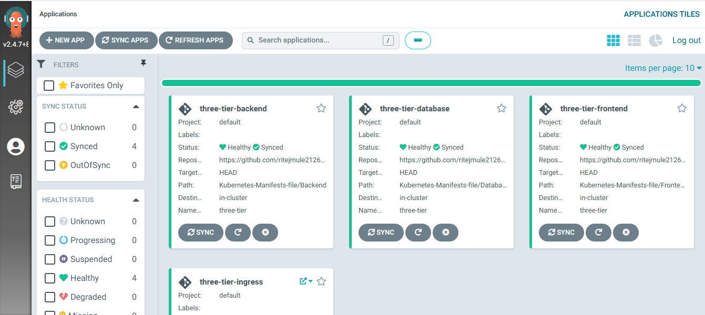
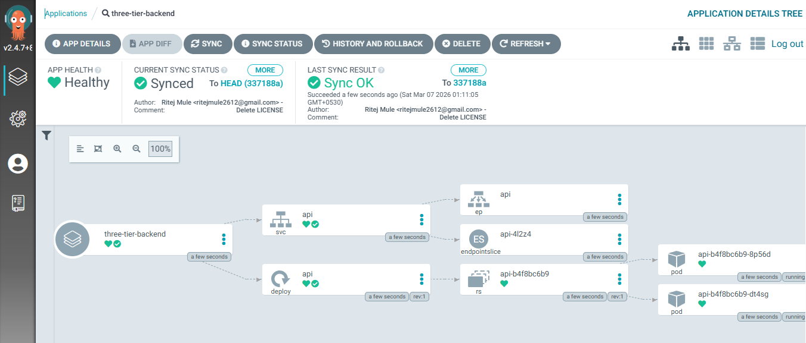
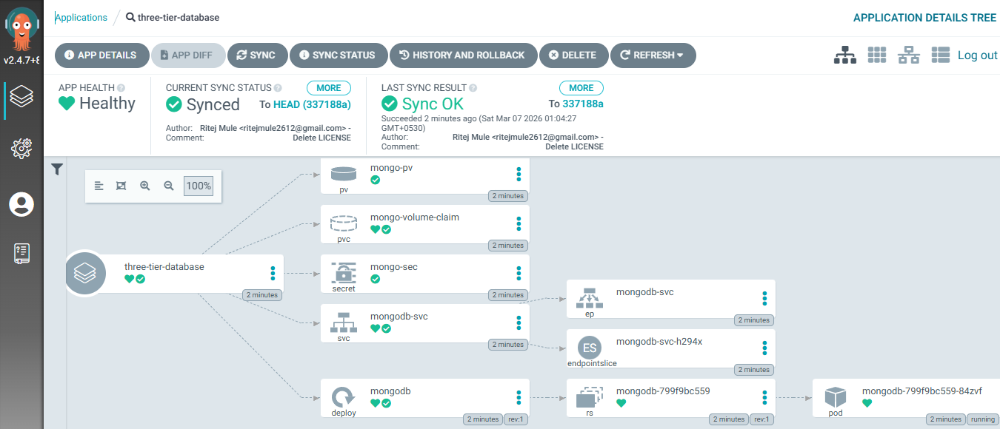
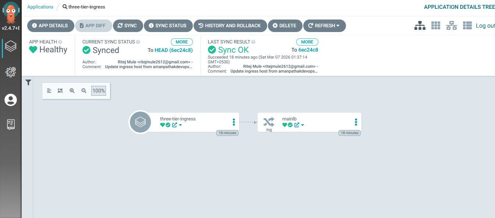
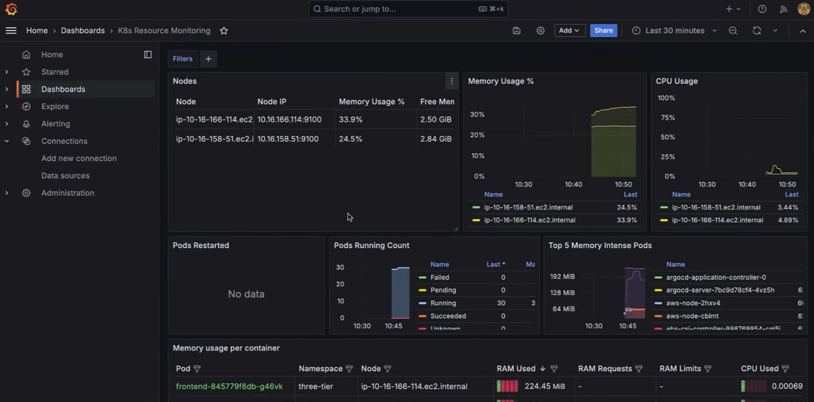

# Three-Tier Web Application Deployment on AWS EKS using AWS EKS, ArgoCD, Prometheus, Grafana, and Jenkins

[](https://www.linkedin.com/in/ritej)
[](https://github.com/ritejmule2126)
[](https://aws.amazon.com)
[](https://www.terraform.io)



Welcome to the Three-Tier Web Application Deployment project! 🚀

This repository hosts the implementation of a Three-Tier Web App using ReactJS, NodeJS, and MongoDB, deployed on AWS EKS. The project covers a wide range of tools and practices for a robust and scalable DevOps setup.

## Table of Contents
- [Application Code](#application-code)
- [Jenkins Pipeline Code](#jenkins-pipeline-code)
- [Jenkins Server Terraform](#jenkins-server-terraform)
- [Kubernetes Manifests Files](#kubernetes-manifests-files)
- [Project Details](#project-details)
- [Infrastructure Components](#infrastructure-components)
- [CI/CD Pipeline](#cicd-pipeline)
- [GitOps with ArgoCD](#gitops-with-argocd)
- [Monitoring & Observability](#monitoring--observability)
- [Screenshots](#screenshots)

## Application Code
The Application-Code directory contains the source code for the Three-Tier Web Application. Dive into this directory to explore the frontend and backend implementations.

## Jenkins Pipeline Code
In the Jenkins-Pipeline-Code directory, you'll find Jenkins pipeline scripts. These scripts automate the CI/CD process, ensuring smooth integration and deployment of your application.

## Jenkins Server Terraform
Explore the Jenkins-Server-TF directory to find Terraform scripts for setting up the Jenkins Server on AWS. These scripts simplify the infrastructure provisioning process.

## Kubernetes Manifests Files
The Kubernetes-Manifests-Files directory holds Kubernetes manifests for deploying your application on AWS EKS. Understand and customize these files to suit your project needs.

## Project Details

🛠️ **Tools Explored:**
- Terraform & AWS CLI for AWS infrastructure
- Jenkins, Sonarqube, Terraform, Kubectl, and more for CI/CD setup
- Helm, Prometheus, and Grafana for Monitoring
- ArgoCD for GitOps practices

🚢 **High-Level Overview:**
- IAM User setup & Terraform magic on AWS
- Jenkins deployment with AWS integration
- EKS Cluster creation & Load Balancer configuration
- Private ECR repositories for secure image management
- Helm charts for efficient monitoring setup
- GitOps with ArgoCD - the cherry on top!

📈 **The journey covered everything from setting up tools to deploying a Three-Tier app, ensuring data persistence, and implementing CI/CD pipelines.**

## Infrastructure Components

### AWS EC2 Infrastructure
The project utilizes multiple EC2 instances for different purposes:

#### Jump Server (Bastion Host)
A secure entry point to access the private infrastructure within the VPC.

*Jump Server configuration running t3.medium instance*

#### Jenkins Server
Dedicated server for CI/CD pipeline execution with comprehensive build and deployment capabilities.

*Jenkins Server running on t2.2xlarge instance*

## CI/CD Pipeline

#### Jenkins Dashboard
Automated build and deployment pipelines for backend, frontend, and infrastructure components.

*Three pipelines configured: Capstone-Infrastructure, Three-tier-backend, and Three-tier-frontend with successful builds*

#### SonarQube Code Quality
Static code analysis ensuring code quality and security standards.

*Quality gates passed for both backend and frontend applications with 0 bugs and vulnerabilities*

## GitOps with ArgoCD

#### ArgoCD Application Dashboard
All three tiers managed through GitOps practices for declarative deployments.

*All applications (backend, database, frontend) in Healthy and Synced status*

#### Backend Architecture in ArgoCD
Detailed view of backend deployment with pods, services, and replica sets.

*Backend deployment showing pods, services, and endpoint slices in running state*

#### Database Architecture in ArgoCD
MongoDB deployment configuration with persistent storage.

*Database deployment with persistent volumes configuration*

#### Ingress Configuration
Load balancer and ingress rules for routing external traffic.

*Ingress controller configuration for routing traffic to appropriate services*

## Monitoring & Observability

#### Grafana Kubernetes Monitoring Dashboard
Real-time monitoring of cluster resources, pod health, and performance metrics.

*Comprehensive monitoring showing:*
- **Memory Usage** per node
- **CPU Usage** trends
- **Running Pods** count
- **Top Memory Intensive Pods** including ArgoCD components
- **Container-level metrics** with detailed RAM usage

## Screenshots

All screenshots are organized in the `screenshots/` directory:

| Component | Description | File |
|-----------|-------------|------|
| Jump Server | Bastion host EC2 configuration | `jump-server.png` |
| Jenkins Server | CI/CD server details | `jenkins-server.png` |
| Jenkins Dashboard | Pipeline overview | `jenkins-dashboard.png` |
| SonarQube | Code quality dashboard | `sonarqube-dashboard.png` |
| ArgoCD | Main application dashboard | `argocd-dashboard.png` |
| Backend ArgoCD | Backend deployment details | `backend-architecture-argocd.png` |
| Database ArgoCD | Database deployment | `database-architecture-argocd.png` |
| Ingress ArgoCD | Ingress configuration | `ingress-architecture-argocd.png` |
| Grafana | Monitoring dashboard | `grafana-dashboard.png` |

## Architecture Overview
```
┌─────────────────────────────────────────────────────────────┐
│                          Internet                           │
└───────────────────┬─────────────────────────────────────────┘
                    │
┌───────────────────▼─────────────────────────────────────────┐
│                    Load Balancer                             │
│                 (Ingress Controller)                         │
└───────────────────┬─────────────────────────────────────────┘
                    │
┌───────────────────▼─────────────────────────────────────────┐
│                   AWS EKS Cluster                           │
│  ┌───────────────┬───────────────┬──────────────────────┐  │
│  │   Frontend    │    Backend    │      Database        │  │
│  │  (ReactJS)    │   (NodeJS)    │     (MongoDB)        │  │
│  └───────────────┴───────────────┴──────────────────────┘  │
└─────────────────────────────────────────────────────────────┘
```

## Getting Started

1. **Clone the repository**
```bash
   git clone https://github.com/ritejmule2126/End-to-End-Kubernetes-Three-Tier-DevSecOps-Project.git
   cd End-to-End-Kubernetes-Three-Tier-DevSecOps-Project
```

2. **Infrastructure Setup**
```bash
   cd Jenkins-Server-TF
   terraform init
   terraform apply
```

3. **CI/CD Pipeline Configuration**
   - Configure Jenkins with the provided pipeline scripts
   - Set up SonarQube for code quality checks
   - Configure AWS credentials in Jenkins

4. **Deploy with ArgoCD**
   - Install ArgoCD on EKS cluster
   - Apply the application manifests
   - Monitor sync status and health

## Contributing
Contributions are welcome! Please feel free to submit a Pull Request.

## Acknowledgments
- Thanks to the DevOps community for continuous learning and support
- Special mention to all the open-source tools that made this project possible
